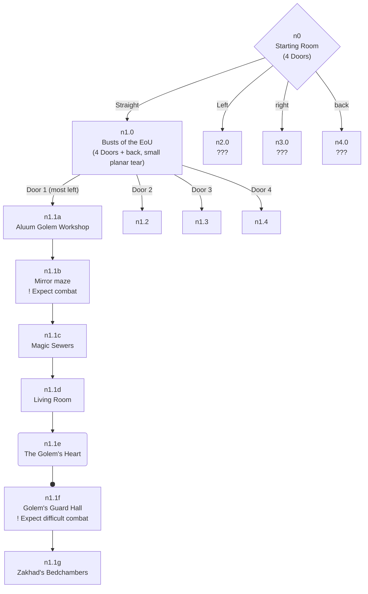

---
title:
draft: false
aliases:
  - 
date:
---
#location [[Kalogeron]]

Dungeon in [[Kalogeron]], used to belong to [[Zakhad]]

# Mapping
> [!note]
> The layout of the tower is *funky*™ and therefore this may or may not actually be useful.

> [!Example] Graph explanation
> - Diamond rooms `{}` have different directions
> 	- they increase the depth of the id (e.g. n1**.1**)
> - Square rooms `[]` have only a door forwards and backwards
> 	- they increment the linear depth (e.g. n1.1**b**)
> - Rounded rooms `()` are dead ends and only go backwards
> - arrowed lines `-->` are moving forwards
> - circle lines `--o` are moving backwards
